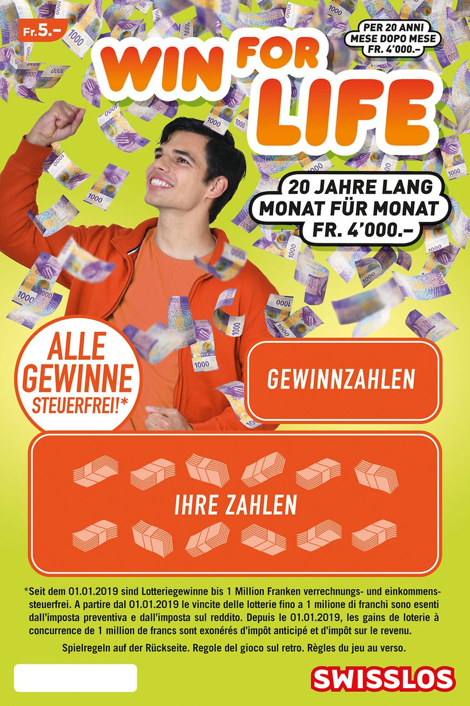
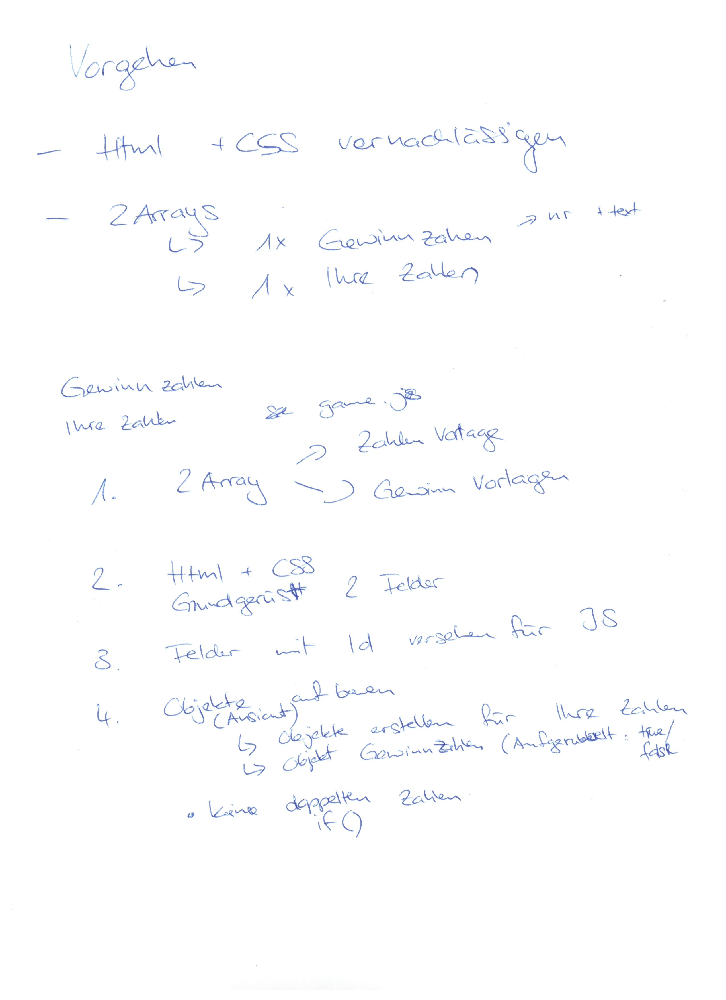
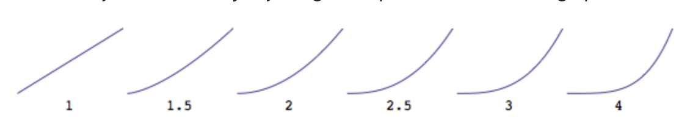

# **Meine Diplomarbeit** 

**Inhaltsverzeichnis**

- [Abstract/Management Summary](#abstract-management-summary)
- [Setup Guide](#setup-guide)
- [URL der lauffähigen Version](#url-zur-diplomarbeit)
- [Zeitplan/Meilensteine](#zeitplan--meilensteine)
- [Technologiekonzept](#technologiekonzept)
- [Zusammenfassung und Ausblick](#zusammenfassung-und-ausblick)
- [Literaturverzeichnis](#literaturverzeichnis)
- [Eidessstattliche Erklärung](#eidessstattliche-erklärung)

### **Abstract Management Summary**

Ich werde die Herausforderung annehmen und die Zusatzaufgabe von Web-Professionals in Angriff nehmen.

<center>
    Let's bring <b>win4life</b> to web.
    <br><br>
    
</center>

---

### **Setup Guide**

1. Terminal öffnen
2. `npm install` laufen lassen
3. Mit `npm run build` die vorinstallierten packages auf installieren.

---

### **URL zur Diplomarbeit**

[win4life by Doris](https://win4life.netlify.app/)

---

### **Zeitplan / Meilensteine**

Mein Ziel war es, mit JavaScript zuerst anzufangen, da ich mich bei der letzten Diplomarbeit zu sehr auf das HTML und CSS konzentriert habe. Mir ist dann die Zeit für das JavaScript davon gelaufen. Dies habe ich nun geändert und es hat funktioniert.

* JavaScript stand dieses Mal im Vordergrund.

* HTML & CSS wurden hinzugefügt, sobald eines nach dem andern Element dazu kam.

<center></center>

---

### **Technologiekonzept**

(inkl. Evaluation der eingesetzen Technologien, Begründung)

---

**Grid bei Gewinnzahlen und ihre Zahlen**

Ich hatte mich von beginn an für `grid` entschieden, da ich dachte, wenn sich das `mediaQuery` wechselt, dass dann ein einfaches umstrukturieren der Felder einfacher ist.

*  beim Styling hatte ich jedoch ab und zu meine Zweifel und wäre gern wieder auf `flex` umgestiegen.

**Dialog-Felder**

Beim letzten Diplomarbeitgespräch hatte Kilian beim `Kontaktaufnahme`-Formular gemeint, dass ich das mit einem `modal` hätte machen können. Mir war das damals kein Begriff. Als ich nun mich nach modal informiert habe, wurde geschrieben, dass `dialog` das neue modal wäre.

* beim `triple-win` dialog hatte ich jedoch meine Probleme beim Styling, da ich ein `background-img` verwenden wollte und `opacity` einbinden wollte. Da musste ich dann einen kleinen Hack anwenden. Mehr dazu in der `Zusammenfassung KW47`.


---

### **Zusammenfassung und Ausblick**

**KW40**

Wie soll mein `win4life` aussehen ?
*  Header & Footer von Swisslos übernehmen.
    *  Die Links müssen nirgends hinführen, aber ein Hamburger-Menu für die Mobil-Ansicht ist notwendig.
*   Kauf von `win4life` soll online möglich sein.
*   Guthaben soll angezeigt werden.
    *   Wird ein Los gekauft, soll es die 5Fr von dem Guthaben reduzieren

Wie baue ich meine Diplomarbeit ?

1. `Gewinnzahlen` und `Ihre Zahlen` erstellen und zum Laufen bringen.
    *   Für beides soll ein Objekt-Array erstellt werden.

2. Gewinn soll beim Guthaben addiert werden. Kauf soll subdrahiert werden.

3. Rückseite des Loses soll durch einen Klick auf `Spielregeln` ersichtlich sein.

**KW41**

- [X] `Gwinnzahlen` und `Ihre Zahlen` mit Funktion erstellen.
- [X] Prototype für `count` erstellt, damit er herausfiltert, wieviele `wins` es bereits bei `Ihren Zahlen` ausgibt. siehe Literaturverzeichnis.

* Was muss noch gelöst werden ?
    * wie schaffe ich es, 1x oder 2x die 21 für WIN anzuzeigen. Dieses Problem werde ich jedoch erst am Schluss der Diplomarbeit angehen. Dafür kann die aktuelle Funktion einfach noch verfeinert werden.

**KW42**
- [X] Mit HTML und CSS begonnen. "Mobile-First"-Prinzip eingeführt, was ich für den Start des Projekts ignoriert habe. Um den JavaScript-Code anzuzeigen.


**KW43**

- [X] `letsGamble`-Funktion im game.js und `renderCard`-Funktion für die Ansicht im index.js erstellt.
- [ ] if-Bedingung für das Prüfen der `gambleNumber` im gambleNumbers mit `.includes()` hat nicht funktioniert.

```ruby
function createNewGambleNumbers() {
    gambleNumbers = [];
    
    for(let i = 0; i < 12; i++){
        let gambleNumber = getRandomWinNumber(20.44);
        let win;
        
        if(gambleNumber !== gameNumbers[20] && gambleNumbers.includes(gambleNumber)){
            i--;
            continue;
        }
        
        if(gambleNumber === gameNumbers[20]){
            {
                win = wins[9];
            }
        } else {
            {
                win = getRandomWin(wins.length - 2);
            }
        };
        
        gambleNumbers.push({
            int: gambleNumber.int,
            string: gambleNumber.string,
            win: win.win,
            currency: win.currency,
            text: win.text
        });
    };
};
```

* Dies vermutlich, da in gambleNumbers ausser `int` und `string` noch `win`, `currency` und `text` vorhanden sind. Aber im gameNumbers nur `int` und `string`.

* bei StackOverflow eine Lösung mit `.some()` gefunden. Ich werde diesen Ansatz ausprobieren und hoffen, dass es funktioniert. Link dazu im Literaturverzeichnis.

MDN:
>The `some()` method tests whether at least one element in the array passes the test implemented by the provided function. It returns true if, in the array, it finds an element for which the provided function returns true; otherwise it returns false. It doesn't modify the array.

**KW44**
- [X] Bei den beiden Objekt-Arrays jeweils `scratched` hinzugefügt, damit später anhand dessen geprüft werden kann, ob alle Felder aufgerubbelt wurden und der Gewinn mitgeteilt werden kann. Nicht, dass bereits nach dem ersten frei gelegten Feld der Gewinn mitteilt wird !

- [X] Bis jetzt hatte ich bei jedem `scratchen` Gewinne mit hohen Beträgen. Dies wollte ich verhindern. Im Google mit der Suche nach `math random with less chance for higher numbers js` bin ich auf StackOverflow auf eine Lösung mit `Math.pow()`
gestossen. Dieses habe ich nun bei der Funktion `getRandomPrice()` eingebaut. Info dazu: siehe Literaturverzeichnis.



Je höher der Exponent, desto kleiner wird die Wahrscheinlichkeit einer höheren Zahl.

- [X] Bei `checkWin()` im check-win.js die `for-Schlaufe` eingefügt, die 2 Arrays miteinander vergleicht und angegeben, was es tun soll, wenn die beiden `.int` von gambleNumbers und winNumbers gleich sind. Siehe Litaraturverzeichnis.

- [X] Anfangs hatte ich die Zahlen als `string`angegeben. Um den Gewinn jedoch zusammen zu zählen, müssen die Gewinne `integer` sein. Dies habe ich angepasst. Nun hatte ich jedoch Probleme mit dem `20Jahre`-Gewinn, da dies ein `string` ist. Dafür habe ich nun die Funktion `checkString()` im index.js erstellt.

**KW45**
- [X] `checkUserData()` erstellt und dafür auch ein Dialog-Feld eingebaut. Damit der Kunde beim ersten Besuch der Webseite den Namen und den Betrag angeben kann, denn er gerne zum Verspielen verwenden würde.

- [X] Das Dialog-Feld habe ich davor bereits für die `Gewinn`- oder den `Verlust`-Meldung eingebaut, aber ohne Eingabefunktion.
    *   Als ich dann das Dialog-Feld im JS mit Click verschinden lassen wollte, ist es immer wieder aufgetaucht.
        *   Wieso ? - Das habe ich bis jetzt leider nicht herausgefunden.
    
    * Dieses Problem konnte ich lösen, indem ich `removeChild` zum `appendChild` bei der `close`-Funktion  eingefügt habe.
        * Wieso verhält sich das Dialog-Feld beim ersten Besuch anders als bei der Gewinn-/Verlust-Info ?
            * Da es eine Eingabefunktion enthält. Damit dies aber bei keinem weiteren Dialog-Feld vorkommt, habe ich das nun bei allen eingebaut.

- [X] Meine Minion-`giphy`'s aus dem Gewinn-/Verlust-Dialog rausgenommen, da ich das `giphy` nicht wie gewünscht stylen konnte. Ich habe bei der Webseite hauptsächlich mit `Font Awesome` gearbeitet, um noch einen kleinen Touch der Webseite hinzuzufügen.

- [X] `buyCard()` erstellt, da wenn ich doppelt auf den `buy`-Button geklickt habe, es den Betrag des Loses abgezogen hat. 


**KW46**
- [ ] Das `footer.html` und das`navigation.html`, welches im Footer angezeigt werden sollte, gelöscht, da ich aus zeitlichen Gründen nicht dazu gekommen wäre. 

- [X] Funktion erstellt, damit winNumbers & gambleNumbers in den LocalStorage gespeichert werden. Bei jedem Refresh der Page hat es "gratis" neue Zahlen gegeben. 

- [X] `scratched`-Class im CSS bei den offenen Feldern hinzugefügt, dass diese auch offen bleiben und der `z-index` bei einem Refresh nicht verloren geht !

**KW47**
- [ ] aus zeitlichen Gründen den Button zur Anzeige der Rückseite (wie in KW40 geschrieben) nicht gemacht. Irgendwie bin ich schon am fixen Footer gescheitert, der dann bei klicken der Links aufgeben sollte. 

- [X] Prototype für `count` gelöscht, da dieser nicht benötigt wurde. habe eine `if`-Bedingung für 3xWin erstellt. Siehe ckeck-win.js.

- [X] Javascript, HTML und CSS etwas aufgeräumt.

*   JS : Alle `Dialog-Felder` in separate js-files genommen, um den überblick besser zu bezahlten.
    * da hatte ich dann plötzlich Probleme mit den clientData-Werten. Da ich clientData im `user` definiert hatte, aber im `dialog_new-user.js` mit den Daten befüllen wollte, kam ich die Information in der Console, dass nur der `getter` definiert war und der `setter` fehlte. Um das Problem zu lösen, musste ich den clientData wie folgt erweitern:

```ruby
    let clientData = {
        name: '',
        amount: 0,
        currency: '',
        set setUser(value){
            this.name = value.name;
            this.amount = value.amount;
            this.currency = value.currency;
        }
};
```
Dazu im Literaturverzeichnis mehr.

---

**FAZIT**

Es ist gut, dass ich mich für die Zusatzaufgabe entschieden habe. Ich habe mich wirklich auf Javascript fokussiert und geschaut, dass ich alle Probleme, die auftauchen könnten, gelöst habe. Wie z.B. das doppelte Klicken auf den `buy`-Button oder, dass wenn man `reload` geglickt hat, neue Nummern zum Vorschein kamen und so "gratis" weitergespielt werden konnte.

* Evtl. hätte ich noch einen `delete`-Button für das Löschen aller clientData-Informationen einbauen sollen, da ich aber das ganze Layout nicht über den kaufen werfen wollte, habe ich das nun weg gelassen.

* Ebenfalls ist mir aufgefallen, dass ich im CSS die `_dialog-win` und `_dialogs` zusammennehmen hätte sollen. Ich habe es in der letzten Woche auch noch versucht, aber damit eher die Webseite gecrasht. Darum habe ich es so belassen.

Hätte ich noch mehr Zeit dafür gehabt, wären diese beiden Punkte noch abgearbeitet worden.

Ich bin froh, dass ich nochmals die Gelegenheit bekommen habe, die Schule zu wiederholen und unter anderem auch JavaScript noch mehr vertiefen konnte. Dieses Mal ist bei JavaScript definitiv mehr hängen geblieben als letztes Mal, wo ich irgendwann nicht mehr aufnahmefähig für Theorie war.

Vielen Dank euch allen !

---

### **Literaturverzeichnis**

[Prototype Count](https://dev.to/kudadam/javascript-how-to-find-the-number-of-times-an-item-appears-in-an-array-10ff)

[.some()](https://stackoverflow.com/questions/8217419/how-to-determine-if-javascript-array-contains-an-object-with-an-attribute-that-e)

[Inhalte zweier Arrays miteinander vergleichen ](https://stackoverflow.com/questions/9639065/a-for-loop-that-compares-two-arrays-looking-for-matching-values)

[dialog](https://www.youtube.com/watch?v=TAB_v6yBXIE)

[math.pow()](https://stackoverflow.com/questions/13758031/generate-random-numbers-with-less-probabilities-of-bigger-numbers)

[clientData auch in anderem JS anpassen](https://www.demirjasarevic.com/javascript-getter-setter/)


---

### **Eidessstattliche Erklärung**

Hiermit erkläre ich, dass ich die Diplomarbeit selbständig verfasst / programmiert und keine anderen als die angegebenen Quellen und Hilfsmittel benutzt und die aus fremden Quellen direkt oder indirekt übernommenen Gedanken als solche kenntlich gemacht habe. Die Arbeit habe ich bisher keinem anderen Prüfungsgremium in gleicher oder vergleichbarer Form vorgelegt. Sie wurde bisher auch nicht veröffentlicht.
