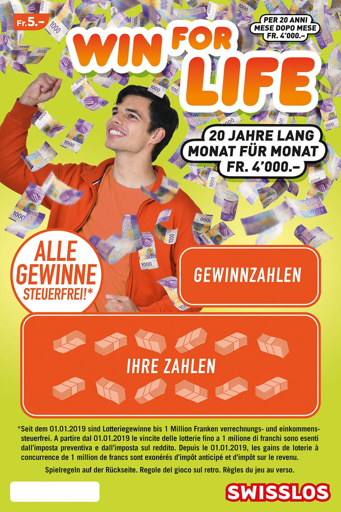
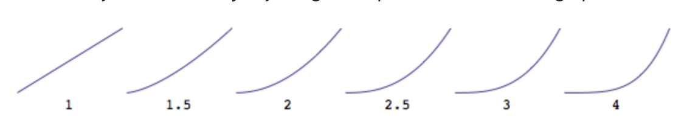

# **Meine Diplomarbeit**

**Inhaltsverzeichnis**

- [Abstract/Management Summary](#abstract-management-summary)
- [Setup Guide](#setup-guide)
- [URL der lauffähigen Version](#url-zur-diplomarbeit)
- [Zeitplan/Meilensteine](#zeitplan--meilensteine)
- [Technologiekonzept](#technologiekonzept)
- [Technische Dokumentation](#technische-dokumentation)
- [Zusammenfassung und Ausblick](#zusammenfassung-und-ausblick)
- [Literaturverzeichnis](#literaturverzeichnis)
- [Eidessstattliche Erklärung](#eidessstattliche-erklärung)

### **Abstract Management Summary**

Ich werde die Herausforderung annehmen und die Zusatzaufgabe von Web-Professionals in Angriff nehmen.

<center>Let's bring <b>winForLife</b> to web.
<br><br>
</center>

---

### **Setup Guide**

1. Terminal öffnen
2. `npm install` laufen lassen
3. Mit `npm run build` die vorinstallierten packages auf installieren.

---

### **URL zur Diplomarbeit**

---

### **Zeitplan / Meilensteine**


---

### **Technologiekonzept**

(inkl. Evaluation der eingesetzen Technologien, Begründung)

---

**Titel**

Text

---

**Titel**

Text

---

### **Technische Dokumentation**

Skizzen von Hand zeichnen, da ich mit Figma noch nicht so versiert bin:

---

### **Zusammenfassung und Ausblick**

**KW40**

Wie soll mein `win4life` aussehen ?
*  Header & Footer von Swisslos übernehmen.
    *  die Links müssen nirgends hinführen, aber ein Hamburger-Menu für die Mobil-Ansicht ist notwendig.
*   Kauf von `win4life` soll online möglich sein.
*   Guthaben soll angezeigt werden.
    *   wird ein los gekauft, soll es die 5Fr von dem Guthaben reduzieren

Wie baue ich meine Diplomarbeit ?

1. `Gewinnzahlen` und `Ihre Zahlen` erstellen und zum Laufen bringen.
    *   für beides soll ein Objekt-Array erstellt werden.

2. Gewinn soll beim Guthaben addiert werden. Kauf soll subdrahiert werden.

3. Rückseite des Loses soll durch einen Klick auf `Spielregeln` ersichtlich sein.

**KW41**

- [X] `Gwinnzahlen` und `Ihre Zahlen` mit Funktion erstellen
- [X] Prototype für `count` erstellt, damit er herausfiltert, wieviele `wins` es bereits bei Ihren Zahlen ausgibt. siehe Literaturverzeichnis

* Was muss noch gelöst werden ?
    * wie schaffe ich es, 1x oder 2x die 21 für WIN anzuzeigen. Dieses Problem werde ich jedoch erst am Schluss de Diplomarbeit angehen. Dafür kann die aktuelle Funktion einfach noch verfeinert werden.

**KW42**
- [X] Angefangen, am HTML und CSS arbeiten. "Mobile-First"-Prinzip, was ich für den Start des Projekts ignoriert habe. Um mit den Basics des JavaScript-Codes zu beginnen.


**KW43**

- [X] `letsGamble`-Funktion im game.js erstellt und `render`-Funktion für die Ansicht im index.js erstellt.
- [ ] if-Bedingung für das Prüfen der `gambleNumber` im gambleNumbers mit `.includes()` hat nicht funktioniert.

```ruby
function createNewGambleNumbers() {
    gambleNumbers = [];
    
    for(let i = 0; i < 12; i++){
        let gambleNumber = getRandomWinNumber(20.44);
        let win;
        
        if(gambleNumber !== gameNumbers[20] && gambleNumbers.includes(gambleNumber)){
            i--;
            continue;
        }
        
        if(gambleNumber === gameNumbers[20]){
            {
                win = wins[9];
            }
        } else {
            {
                win = getRandomWin(wins.length - 2);
            }
        };
        
        gambleNumbers.push({
            int: gambleNumber.int,
            string: gambleNumber.string,
            win: win.win,
            currency: win.currency,
            text: win.text
        });
    };
};
```

* dies vermutlich, da in gambleNumbers ausser `int` und `string `noch `win`, `currency` und `text` vorhanden sind. Aber im gambleNumbers nur `int` und `string`.

* bei StackOverflow eine Lösung mit `.some()` gefunden. werde diesen Ansatz ausprobieren und hoffen, dass es funktioniert. Link dazu im Literaturverzeichnis.

MDN:
>The `some()` method tests whether at least one element in the array passes the test implemented by the provided function. It returns true if, in the array, it finds an element for which the provided function returns true; otherwise it returns false. It doesn't modify the array.

**KW44**
- [X] bei den beiden Objekten jeweils `scratched` hinzugefügt, damit später hand dessen geprüft werden kann, ob alle Felder aufgerubbelt wurden und der Gewinn mitgeteilt werden kann. Nicht, dass der Gewinn bereits nach dem ersten frei gelegten Feld den Gewinn mitteilt !

- [X] bis jetzt hatte ich bei jedem `scratchen` Gewinne mit hohen Beträgen. Dies wollte ich verhindern. Im Google mit der Suche nach `math random with less chance for higher numbers js` bin ich auf StackOverflow auf eine Lösung mit `math.pow()`
gestossen. Siehe Literaturverzeichnis.



Je höher der Exponent ist, desto kleiner wird die Wahrscheinlichkeit einer höheren Zahl.

- [X] Anfangs hatte ich die Zahlen als String angegeben. Um den Gewinn jedoch zusammen zu zählen, müssen die Gewinne `Integer` sein. Dies habe ich angepasst. Nun hatte ich jedoch Probleme mit dem `20Jahre`-Gewinn. Da dies ein `String` ist. Dafür habe ich nun die Funktion `checkString()` erstellt.

**KW45**

**KW46**

**KW47**

---

**FAZIT**

---

### **Literaturverzeichnis**

[Prototype Count](https://dmitripavlutin.com/javascript-array-contains-value/)

[.some()](https://stackoverflow.com/questions/8217419/how-to-determine-if-javascript-array-contains-an-object-with-an-attribute-that-e)

[2 Arrays prüfen](https://stackoverflow.com/questions/9639065/a-for-loop-that-compares-two-arrays-looking-for-matching-values)

[Dialog-Feld verwenden für Info zu Gewinn](https://www.youtube.com/watch?v=TAB_v6yBXIE)

[math.pow()](https://stackoverflow.com/questions/13758031/generate-random-numbers-with-less-probabilities-of-bigger-numbers)

---

### **Eidessstattliche Erklärung**

Hiermit erkläre ich, dass ich die Diplomarbeit selbständig verfasst / programmiert und keine anderen als die angegebenen Quellen und Hilfsmittel benutzt und die aus fremden Quellen direkt oder indirekt übernommenen Gedanken als solche kenntlich gemacht habe. Die Arbeit habe ich bisher keinem anderen Prüfungsgremium in gleicher oder vergleichbarer Form vorgelegt. Sie wurde bisher auch nicht veröffentlicht.
